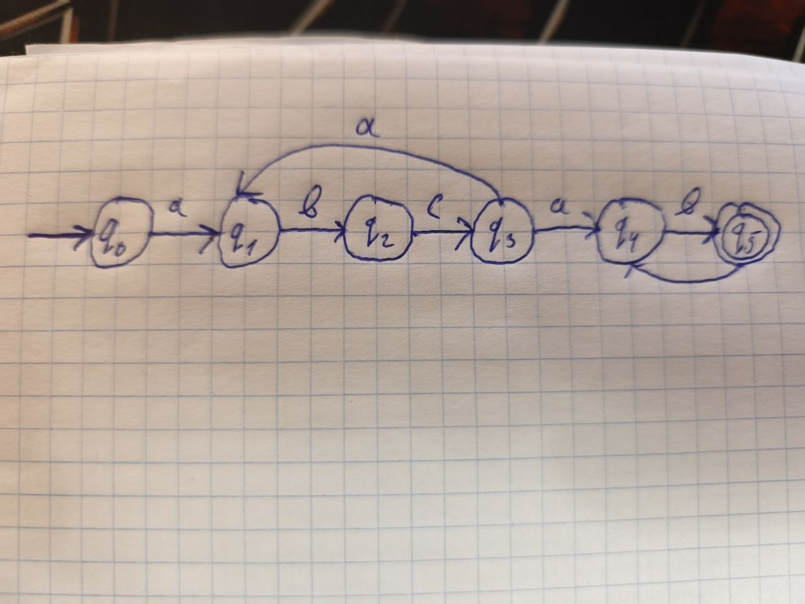
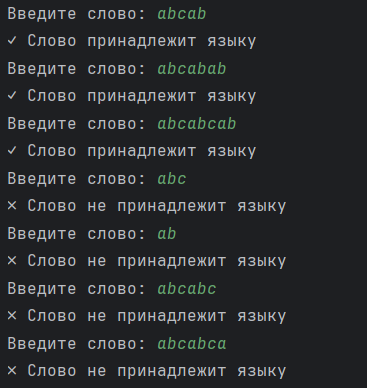

# Лабораторная работа №1

## Тема

**Реализация конечного автомата для распознавания формальных языков**

---

## Цель работы

Целью лабораторной работы является разработка программного решения, реализующего детерминированный конечный автомат для распознавания слов заданного формального языка.

В рамках работы необходимо определить структуру допустимых слов согласно индивидуальному варианту, разработать диаграмму конечного автомата, реализовать алгоритм его работы на языке Python и проверить программу на корректных и некорректных входных данных.

---

## Постановка задачи

Согласно индивидуальному варианту необходимо распознавать слова языка:

$$
8. `(abc)ⁿ(ab)ᵐ`, n ≥ 1, m ≥ 1
$$

Это означает, что корректное слово должно состоять из:

1. одного или нескольких повторений блока `abc`;
2. после них должно находиться одно или несколько повторений блока `ab`.


### Примеры слов, принадлежащих языку

| Слово             | Представление                    | Результат     |
| ----------------- | -------------------------------- | ------------- |
| `abcab`           | `abc + ab`                       | ✅ Принадлежит |
| `abcabab`         | `abc + ab + ab`                  | ✅ Принадлежит |
| `abcabcab`        | `abc + abc + ab`                 | ✅ Принадлежит |
| `abcabcabab`      | `abc + abc + ab + ab`            | ✅ Принадлежит |
| `abcabcabcababab` | `abc + abc + abc + ab + ab + ab` | ✅ Принадлежит |

### Примеры слов, не принадлежащих языку

| Слово     | Причина                   | Результат        |
| --------- | ------------------------- | ---------------- |
| `abc`     | отсутствует блок `ab`     | ❌ Не принадлежит |
| `ab`      | отсутствует блок `abc`    | ❌ Не принадлежит |
| `abab`    | отсутствует блок `abc`    | ❌ Не принадлежит |
| `abcabc`  | отсутствует блок `ab`     | ❌ Не принадлежит |
| `abcba`   | нарушена структура слова  | ❌ Не принадлежит |
| `abcabca` | остался лишний символ `a` | ❌ Не принадлежит |

---

## Принцип работы конечного автомата

Автомат последовательно читает символы входного слова.

Сначала он должен распознать хотя бы один блок:

```text
abc
```

После этого автомат должен перейти к распознаванию блоков:

```text
ab
```

Количество блоков не ограничено сверху.

Для обозначения состояний используются:

* `q0` — начальное состояние;
* `q1` — прочитан символ `a`;
* `q2` — прочитано `ab`;
* `q3` — прочитан полный блок `abc`;
* `q4` — прочитан символ `a` после завершённого блока `abc`;
* `q5` — прочитан полный блок `ab`, принимающее состояние.

Состояние `q5` является конечным, поскольку слово может завершаться только после полного блока `ab`.

---

## Диаграмма конечного автомата



## Программная реализация

Для реализации используется язык программирования **Python**.

```python
def finite_automaton(word):
    # Пустое слово не подходит,
    # так как n >= 1 и m >= 1
    if not word:
        return False

    # Проверяем, что слово состоит только из a, b, c
    if any(symbol not in "abc" for symbol in word):
        return False

    i = 0
    n = 0
    m = 0

    # Сначала обязательно должен идти хотя бы один блок abc
    while i + 2 < len(word) and word[i:i + 3] == "abc":
        n += 1
        i += 3

    # n должно быть не меньше 1
    if n == 0:
        return False

    # Затем обязательно должен идти хотя бы один блок ab
    while i + 1 < len(word) and word[i:i + 2] == "ab":
        m += 1
        i += 2

    # m должно быть не меньше 1
    if m == 0:
        return False

    # Если дошли до конца — слово принято
    return i == len(word)


def main():
    print("=== Конечный автомат ===")
    print("Язык: (abc)^n(ab)^m")
    print("Условия: n >= 1, m >= 1")
    print("Введите 'exit' для завершения.\n")

    while True:
        word = input("Введите слово: ")

        if word == "exit":
            break

        if finite_automaton(word):
            print("✓ Слово принадлежит языку")
        else:
            print("✗ Слово не принадлежит языку")


if __name__ == "__main__":
    main()
```

---

## Описание программного кода

### Проверка пустого слова

```python
if not word:
    return False
```

Если пользователь не ввёл никаких символов, слово не может принадлежать языку, поскольку требуется как минимум один блок `abc` и один блок `ab`.

---

### Проверка допустимых символов

```python
if any(symbol not in "abc" for symbol in word):
    return False
```

Данная проверка убеждается, что слово содержит только символы:

```text
a, b, c
```

Например:

```text
abcabab
```

является допустимым.

А слово:

```text
abcabd
```

содержит символ `d`, поэтому оно сразу отклоняется.

Переменная `symbol` обозначает **текущий символ слова**.

---

### Переменная `i`

```python
i = 0
```

Переменная `i` используется как индекс текущей позиции в слове.

Например:

```text
a b c a b
0 1 2 3 4
```

Если `i = 0`, программа рассматривает первый символ.

Если `i = 3`, программа рассматривает символ `a` на позиции 3.

---

### Счётчик `n`

```python
n = 0
```

Переменная `n` хранит количество найденных блоков `abc`.

Например, для слова:

```text
abcabcab
```

получаем:

```text
abc + abc + ab
```

Следовательно:

```text
n = 2
```

---

### Поиск блоков `abc`

```python
while i + 2 < len(word) and word[i:i + 3] == "abc":
    n += 1
    i += 3
```

Цикл проверяет, находится ли в текущей позиции последовательность:

```text
abc
```

Если блок найден:

```python
n += 1
```

увеличивает количество найденных блоков на единицу.

Затем:

```python
i += 3
```

перемещает индекс на три позиции вперёд.

Например, для:

```text
abcabcab
```

получается:

```text
abc | abc | ab
```

После обработки двух первых блоков:

```text
n = 2
i = 6
```

---

### 8.6. Проверка условия `n >= 1`

```python
if n == 0:
    return False
```

Если ни одного блока `abc` найдено не было, слово не соответствует варианту.

---

### Счётчик `m`

```python
m = 0
```

Переменная `m` хранит количество найденных блоков `ab`.

Например:

```text
abcabab
```

можно представить как:

```text
abc + ab + ab
```

Поэтому:

```text
n = 1
m = 2
```

---

### Поиск блоков `ab`

```python
while i + 1 < len(word) and word[i:i + 2] == "ab":
    m += 1
    i += 2
```

Программа проверяет наличие блока:

```text
ab
```

Если блок найден, значение `m` увеличивается на единицу, а индекс перемещается на две позиции.

---

### Проверка условия `m >= 1`

```python
if m == 0:
    return False
```

Если ни одного блока `ab` найдено не было, слово не принадлежит языку.

Например:

```text
abcabc
```

содержит только:

```text
abc + abc
```

Поэтому:

```text
n = 2
m = 0
```

и слово отклоняется.

---

### Проверка конца слова

```python
return i == len(word)
```

Это последняя проверка.

Она необходима, чтобы убедиться, что программа обработала **все символы слова**.

Например:

```text
abcabca
```

можно разделить как:

```text
abc + abc + a
```

Последний символ `a` является лишним.

Поэтому индекс `i` не совпадёт с длиной слова, и функция вернёт:

```python
False
```

---

## Основная функция программы

Функция:

```python
def main():
```

отвечает за взаимодействие с пользователем.

Пользователь вводит слово:

```python
word = input("Введите слово: ")
```

После этого слово передаётся функции:

```python
finite_automaton(word)
```

Если функция возвращает `True`, выводится:

```text
✓ Слово принадлежит языку
```

Если функция возвращает `False`:

```text
✗ Слово не принадлежит языку
```

Команда:

```text
exit
```

завершает работу программы.

---

## Тестирование программы

Для проверки корректности были использованы различные входные слова.

### Корректные данные


---

## 11. Результаты тестирования

|  № | Входное слово | Ожидаемый результат | Полученный результат |
| -: | ------------- | ------------------- | -------------------- |
|  1 | `abcab`       | Принадлежит         | Принадлежит          |
|  2 | `abcabab`     | Принадлежит         | Принадлежит          |
|  3 | `abcabcab`    | Принадлежит         | Принадлежит          |
|  4 | `abcabcabab`  | Принадлежит         | Принадлежит          |
|  5 | `abc`         | Не принадлежит      | Не принадлежит       |
|  6 | `ab`          | Не принадлежит      | Не принадлежит       |
|  7 | `abcabc`      | Не принадлежит      | Не принадлежит       |
|  8 | `abcabca`     | Не принадлежит      | Не принадлежит       |

Все рассмотренные тесты дали ожидаемый результат.



## Вывод

В ходе лабораторной работы был разработан алгоритм распознавания формального языка:

$$
8. `(abc)ⁿ(ab)ᵐ`, n ≥ 1, m ≥ 1
$$

Была определена структура допустимых слов и разработана диаграмма конечного автомата с состояниями `q0`–`q5`.

Программа на языке Python последовательно анализирует входное слово, проверяет допустимые символы, определяет количество блоков `abc` и `ab`, а также контролирует выполнение условий `n ≥ 1` и `m ≥ 1`.

В результате тестирования программа правильно определяет принадлежность как корректных, так и некорректных слов заданному формальному языку.

Таким образом, поставленная цель лабораторной работы выполнена.
